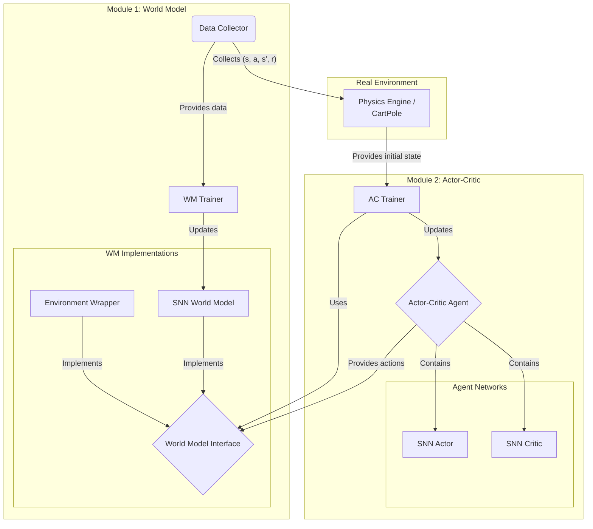
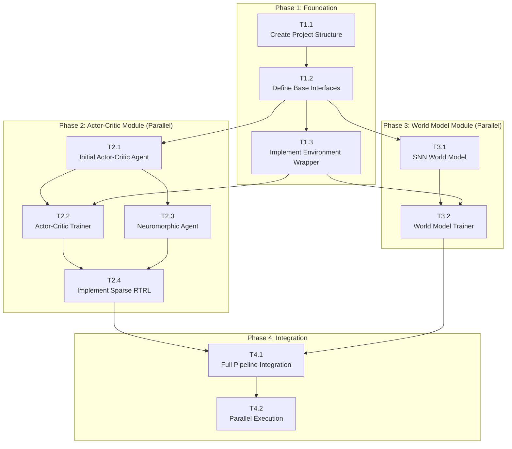

# Neuromorphic Model-Based Reinforcement Learning (NMBRL) Implementation Plan

## 1. Overview & Goals

This document outlines a plan to implement a neuromorphic model-based reinforcement learning (MBRL) framework within this repository. The primary motivation is to leverage the energy efficiency of neuromorphic computing for the computationally intensive task of MBRL, enabling real-world deployment for fast (sample-efficient) and mobile on-device (energy-efficient) learning.

### Core Goals:
- **Sample and Energy-Efficient Learning:** The primary goal is to achieve both sample-efficient and energy-efficient learning. This will be accomplished by:
    - Utilizing Spiking Neural Networks (SNNs) with sparse activations and connectivity to reduce the computational cost of the world model and the agent during both **training and inference**.
    - Retaining the sample efficiency of MBRL by training the agent on a learned world model.
- **Fast Embedded Learning:** A key research question to investigate is: *How fast can the agent learn CartPole from scratch with computation suitable for embedded systems?*
- **Modularity:** Design the system with swappable components (world model, agent, environment) to encourage experimentation and extension to new environments beyond CartPole.
- **Parallel Development:** Structure the project to allow multiple developers to work on different modules concurrently.
- **On-Chip Learning Potential:** Employ learning rules like sparse Real-Time Recurrent Learning (RTRL) that are amenable to future on-chip hardware implementation.

## 2. System Architecture

The system will be architected into two primary modules that operate in a decoupled, parallel manner:
1.  **World Model (WM) Module:** Responsible for learning a predictive model of the environment's dynamics.
2.  **Actor-Critic (AC) Module:** Responsible for learning a policy (actor) and a value function (critic) using the world model.

These two modules interact through a well-defined `WorldModel` interface, allowing the AC module to be agnostic to whether it's interacting with the real environment or a learned SNN model.



## 3. Proposed Project Structure

To maintain modularity and separation from the existing codebase, the new components will reside in a dedicated directory.

```
Neuromorphic_MBRL/
├── agents/
│   ├── __init__.py
│   ├── actor_critic_agent.py   # Defines the agent, its networks, and learning rule
│   └── base_agent.py           # Abstract base class for agents
├── world_models/
│   ├── __init__.py
│   ├── environment_wrapper.py  # Wraps the existing environment to fit the WM interface
│   ├── snn_world_model.py      # The SNN-based world model implementation
│   └── base_world_model.py     # Abstract base class for world models
├── learning/
│   ├── __init__.py
│   ├── actor_critic_trainer.py # Training loop for the AC module
│   └── world_model_trainer.py  # Training loop for the WM module
├── utils/
│   └── __init__.py
└── run_mbrl.py                 # Main script to configure and run an experiment
```

## 4. Development Roadmap & Task Breakdown

The project can be broken down into the following phases and tasks. This structure allows for parallel work on the World Model and Actor-Critic components after the initial foundation is laid.

| Phase                      | Task ID | Task Description                                                                                                                                                                                        | Key Components/Files                     | Dependencies                   |
| :------------------------- | :------ | :------------------------------------------------------------------------------------------------------------------------------------------------------------------------------------------------------ | :--------------------------------------- | :----------------------------- |
| **1. Foundation**          | T1.1    | **Create Project Structure:** Set up the directory and `__init__.py` files as outlined above.                                                                                                           | `Neuromorphic_MBRL/`                     | -                              |
|                            | T1.2    | **Define Base Interfaces:** Create the abstract base classes `BaseWorldModel` and `BaseAgent`.                                                                                                          | `base_world_model.py`, `base_agent.py`   | T1.1                           |
|                            | T1.3    | **Implement Environment Wrapper:** Create a concrete `WorldModel` by wrapping the existing `CartPole` simulation. This allows agent development to begin immediately.                                   | `environment_wrapper.py`                 | T1.2                           |
| **2. Actor-Critic Module** | T2.1    | **Initial Actor-Critic Agent:** Implement an `ActorCriticAgent` with standard dense (non-spiking) networks (e.g., using TensorFlow/PyTorch).                                                            | `actor_critic_agent.py`                  | T1.2                           |
|                            | T2.2    | **Actor-Critic Trainer:** Create the training loop that has the agent interact with the `WorldModel` interface (using the `EnvironmentWrapper` for now).                                                | `actor_critic_trainer.py`, `run_mbrl.py` | T1.3, T2.1                     |
|                            | T2.3    | **Neuromorphic Agent:** Replace the dense actor and critic networks with SNNs.                                                                                                                          | `actor_critic_agent.py`                  | T2.1                           |
|                            | T2.4    | **Implement Sparse RTRL:** Adapt the `ActorCriticTrainer` to use a sparse RTRL algorithm for updating the SNN agent.                                                                                    | `actor_critic_trainer.py`                | T2.2, T2.3                     |
| **3. World Model Module**  | T3.1    | **SNN World Model:** Implement the `SNNWorldModel` class. Initially, this can be a simple recurrent SNN architecture.                                                                                   | `snn_world_model.py`                     | T1.2                           |
|                            | T3.2    | **World Model Trainer:** Implement the training loop for the `SNNWorldModel`. It should sample data from the real environment and train the SNN to predict `(s', r) = f(s, a)`.                         | `world_model_trainer.py`                 | `environment_wrapper.py`, T3.1 |
| **4. Integration**         | T4.1    | **Full Pipeline Integration:** Update `run_mbrl.py` to run both training modules. The `ActorCriticTrainer` should be configured to use the trained `SNNWorldModel` instead of the `EnvironmentWrapper`. | `run_mbrl.py`                            | T2.4, T3.2                     |
|                            | T4.2    | **Parallel Execution:** Refactor the training loops to run concurrently, with the agent training on the latest version of the world model.                                                              | `run_mbrl.py`, `*_trainer.py`            | T4.1                           |

## 5. Task Dependencies

The following graph visualizes the dependencies between the tasks outlined in the roadmap. This highlights the opportunities for parallel development after the initial foundation is complete.


