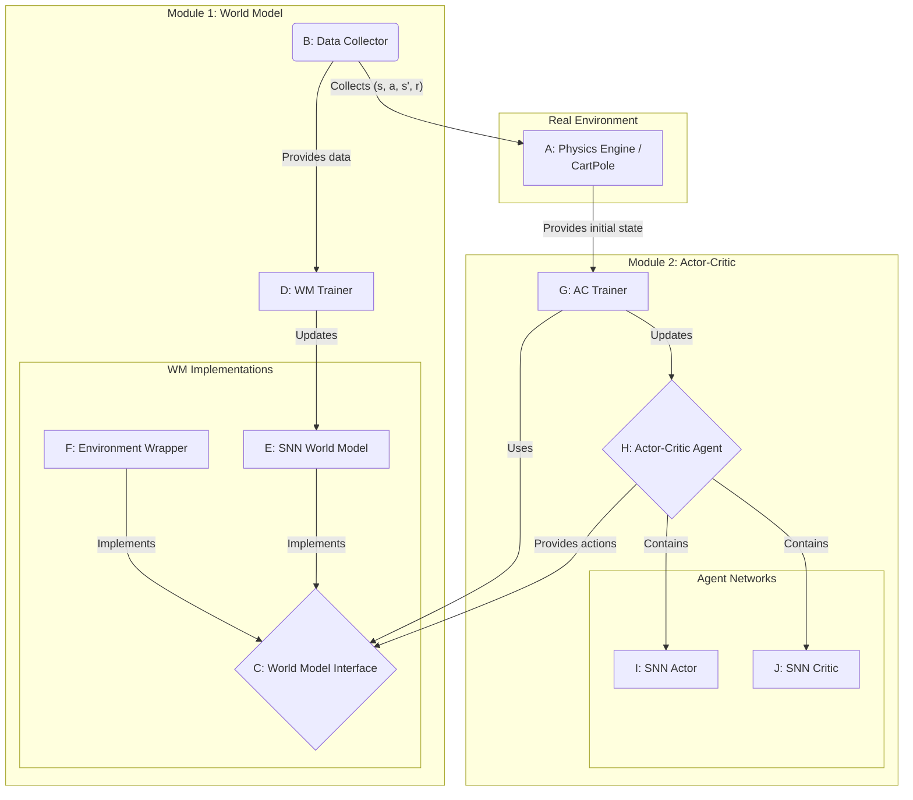
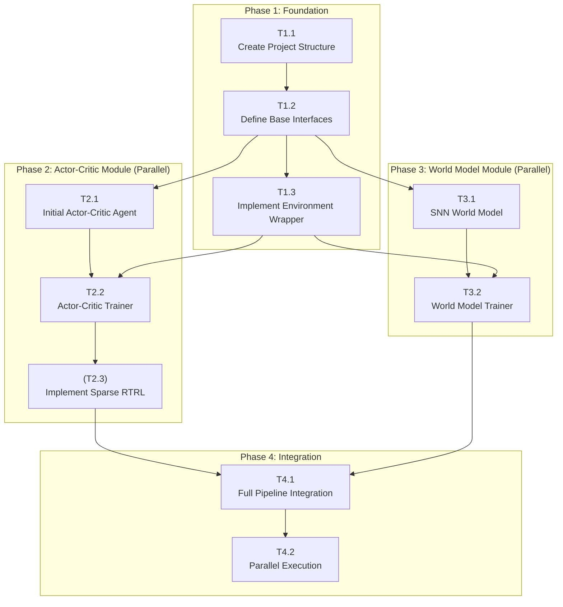

# Neuromorphic Model-Based Reinforcement Learning (NMBRL) Implementation Plan

## 1. Overview & Goals

This document outlines a plan to implement a neuromorphic model-based reinforcement learning (MBRL) framework within this repository. The primary motivation is to leverage the energy efficiency of neuromorphic computing for the computationally intensive task of MBRL, enabling real-world deployment for fast (sample-efficient) and mobile on-device (energy-efficient) learning.

### Core Goals:
- **Sample and Energy-Efficient Learning:** The primary goal is to achieve both sample-efficient and energy-efficient learning. This will be accomplished by:
    - Utilizing Spiking Neural Networks (SNNs) with sparse activations and connectivity to reduce the computational cost of the world model and the agent during both **training and inference**.
    - Retaining the sample efficiency of MBRL by training the agent on a learned world model.
- **Fast Embedded Learning:** A key research question to investigate is: *How fast can the agent learn CartPole from scratch with computation suitable for embedded systems?*
- **Modularity:** Design the system with swappable components (world model, agent, environment) to encourage experimentation and extension to new environments beyond CartPole.
- **Parallel Development:** Structure the project to allow multiple developers to work on different modules concurrently.
- **On-Chip Learning Potential:** Employ learning rules like sparse Real-Time Recurrent Learning (RTRL) that are amenable to future on-chip hardware implementation.

## 2. System Architecture

The system will be architected into two primary modules that operate in a decoupled, parallel manner:
1.  **World Model (WM) Module:** Responsible for learning a predictive model of the environment's dynamics.
2.  **Actor-Critic (AC) Module:** Responsible for learning a policy (actor) and a value function (critic) using the world model.

These two modules interact through a well-defined `WorldModel` interface, allowing the AC module to be agnostic to whether it's interacting with the real environment or a learned SNN model.



### Architecture Component Mapping

The components in the architecture diagram above map to the following files and development tasks:

| Diagram ID | Component Name        | Implementation File(s)                 | Development Task(s) |
| :--------: | :-------------------- | :------------------------------------- | :------------------ |
|     A      | Physics Engine        | `environments/CartPoleSimulation/`     | Pre-existing        |
|     B      | Data Collector        | `learning/world_model_trainer.py`      | T3.2                |
|     C      | World Model Interface | `world_models/base_world_model.py`     | T1.2                |
|     D      | WM Trainer            | `learning/world_model_trainer.py`      | T3.2                |
|     E      | SNN World Model       | `world_models/snn_world_model.py`      | T3.1                |
|     F      | Environment Wrapper   | `world_models/ini_cartpole_wrapper.py` | T1.3                |
|     G      | AC Trainer            | `learning/actor_critic_trainer.py`     | T2.2, T2.4          |
|     H      | Actor-Critic Agent    | `agents/actor_critic_agent.py`         | T2.1                |
|    I, J    | SNN Actor/Critic      | `agents/actor_critic_agent.py`         | T2.1                |

## 3. Project Structure

To maintain modularity the project will have following structure:

```
Neuromorphic_MBRL/
├── agents/
│   ├── __init__.py
│   ├── actor_critic_agent.py   # Defines the SNN-based actor-critic agent
│   └── base_agent.py           # Abstract base class for agents
├── configs/
│   └── actor_critic_config.yaml  # Configuration files for experiments
├── environments/
│   └── CartPoleSimulation/     # The CartPole simulation environment (submodule)
├── learning/
│   ├── __init__.py
│   ├── actor_critic_trainer.py # Training loop for the AC module
│   └── world_model_trainer.py  # Training loop for the WM module
├── networks/
│   └── mlp.py                  # MLP network definitions
├── testing/
│   ├── test_ini_cartpole_wrapper.py # Tester for ini_cartpole_wrapper
│   └── test_snn_actor_critic.py     # Tester for the actor critic networks
├── world_models/
│   ├── __init__.py
│   ├── ini_cartpole_wrapper.py # Wraps the existing environment to fit the WM interface
│   ├── snn_world_model.py      # The SNN-based world model implementation
│   └── base_world_model.py     # Abstract base class for world models
├── utils/
│   └── __init__.py
├── README.md                   # This readme file
├── run_mbrl.py                 # Main script to configure and run an experiment
└── visualize_and_evaluate.py   # Script for loading and evaluating trained models
```

## 4. Development Roadmap & Task Breakdown

The project can be broken down into the following phases and tasks. This structure allows for parallel work on the World Model and Actor-Critic components after the initial foundation is laid.

| Phase                      | Task ID | Status | Task Description                                                                                                                                                                                        | Key Components/Files                     | Dependencies                    |
| :------------------------- | :------ | :----: | :------------------------------------------------------------------------------------------------------------------------------------------------------------------------------------------------------ | :--------------------------------------- | :------------------------------ |
| **1. Foundation**          | T1.1    |   ✅    | **Create Project Structure:** Set up the directory and `__init__.py` files as outlined above.                                                                                                           | `Neuromorphic_MBRL/`                     | -                               |
|                            | T1.2    |   ✅    | **Define Base Interfaces:** Create the abstract base classes `BaseWorldModel` and `BaseAgent`.                                                                                                          | `base_world_model.py`, `base_agent.py`   | T1.1                            |
|                            | T1.3    |   ✅    | **Implement Environment Wrapper:** Create a concrete `WorldModel` by wrapping the existing `CartPole` simulation. This allows agent development to begin immediately.                                   | `ini_cartpole_wrapper.py`                | T1.2                            |
| **2. Actor-Critic Module** | T2.1    |   ✅    | **Initial Actor-Critic Agent:** Implement an `ActorCriticAgent` class structure.                                                                                                                        | `actor_critic_agent.py`                  | T1.2                            |
|                            | T2.2    |   ✅    | **Actor-Critic Trainer:** Create the training loop that has the agent interact with the `WorldModel` interface (using the `EnvironmentWrapper` for now).                                                | `actor_critic_trainer.py`, `run_mbrl.py` | T1.3, T2.1                      |
|                            | (T2.3)  |   -    | (**Implement Sparse RTRL:**) Adapt the `ActorCriticTrainer` to use a sparse RTRL algorithm for updating the SNN agent.                                                                                  | `actor_critic_trainer.py`                | T2.2                            |
| **3. World Model Module**  | T3.1    |   -    | **World Model:** Implement the `SNNWorldModel` class. Initially, this can be a simple recurrent SNN architecture.                                                                                       | `snn_world_model.py`                     | T1.2                            |
|                            | T3.2    |   -    | **World Model Trainer:** Implement the training loop for the `SNNWorldModel`. It should sample data from the real environment and train the SNN to predict `(s', r) = f(s, a)`.                         | `world_model_trainer.py`                 | `ini_cartpole_wrapper.py`, T3.1 |
| **4. Integration**         | T4.1    |   -    | **Full Pipeline Integration:** Update `run_mbrl.py` to run both training modules. The `ActorCriticTrainer` should be configured to use the trained `SNNWorldModel` instead of the `EnvironmentWrapper`. | `run_mbrl.py`                            | T2.3, T3.2                      |
|                            | T4.2    |   -    | **Parallel Execution:** Refactor the training loops to run concurrently, with the agent training on the latest version of the world model.                                                              | `run_mbrl.py`, `*_trainer.py`            | T4.1                            |

## 5. Task Dependencies

The following graph visualizes the dependencies between the tasks outlined in the roadmap. This highlights the opportunities for parallel development after the initial foundation is complete.



## 6. Tutorial: Model-Based Reinforcement Learning with an Actor-Critic Agent

This section provides a conceptual overview of the Model-Based Reinforcement Learning (MBRL) approach with an Actor-Critic agent, as implemented in this project.

### 6.1 What is Model-Based Reinforcement Learning?

In contrast to model-free RL (where an agent learns a policy through trial-and-error interacting directly with the environment), MBRL involves two distinct stages:

1.  **Learn a Model:** First, the agent learns a *model* of the environment. This "world model" is a function that predicts the consequences of actions. Given a current state `s` and an action `a`, the model predicts the next state `s'` and the immediate reward `r`.
2.  **Train an Agent:** Once the world model is learned, the agent is trained on this model instead of the real environment. The agent can "imagine" or "dream" of interacting with the environment by using the world model to simulate trajectories.

The primary advantage of MBRL is **sample efficiency**. Since the agent can generate a vast amount of simulated experience from the learned model, it requires significantly fewer interactions with the real environment, which can be expensive, slow, or dangerous.

### 6.2 The Actor-Critic Method

Actor-Critic is a popular model-free RL algorithm that we use to train our agent *within* the learned world model. It combines the strengths of two other types of algorithms:

-   **The Actor:** This is the policy. It takes the current state `s` as input and decides which action `a` to take (`a = π(s)`). The actor's goal is to learn the optimal policy.
-   **The Critic:** This is a value function. It evaluates the "goodness" of a state or a state-action pair by predicting the expected future reward (the "value"). For instance, `V(s)` estimates the total reward an agent can expect to receive starting from state `s`.

The Actor and Critic work together: The Actor selects an action, and the Critic evaluates how good that action was. The Actor then updates its policy based on the Critic's feedback, making it more likely to choose actions that the Critic deems good. Simultaneously, the Critic improves its own estimations by observing the rewards received.

### 6.3 Integrating MBRL with Actor-Critic: The "Dreamer" Loop

This project combines MBRL and Actor-Critic in a powerful loop, inspired by algorithms like [Dreamer](https://www.nature.com/articles/s41586-025-08744-2). Here's how it works:

1.  **Data Collection (Interaction with Reality):** Initially, the agent interacts with the real environment (the `INICartPoleWrapper`) using a preliminary (e.g., random) policy to collect a set of experiences `(s, a, s', r)`.

2.  **World Model Training (Learning the Dynamics):** The `WorldModelTrainer` uses this collected data to train the `SNNWorldModel`. This is a supervised learning problem where the model learns to predict `(s', r)` given `(s, a)`.

3.  **Behavior Learning (Training in "Imagination"):** This is the core of the sample efficiency gain. The `ActorCriticTrainer` trains the `ActorCriticAgent` *entirely within the learned `SNNWorldModel`*.
    - The trainer simulates long trajectories of experience using the world model without ever touching the real environment.
    - For each step in the imagination, the **Actor** proposes an action. The **World Model** predicts the next state and reward. The **Critic** evaluates the imagined state.
    - This large volume of imagined data is used to update the Actor and Critic networks. Because this all happens in simulation, it is fast and generates no wear-and-tear on real hardware.

4.  **Repeat:** After a period of "dreaming," the improved Actor is used to interact with the real environment again (Step 1), collecting higher-quality data. This new data is used to further refine the world model (Step 2), which in turn allows for even better agent training (Step 3).

This cycle allows the agent to build a robust understanding of the world and a high-performance policy with minimal real-world interaction. The use of SNNs for both the world model and the agent further aims to make the computationally-heavy "dreaming" phase energy-efficient.

### 6.4 Mathematical Formulation

To understand the learning process more deeply, let's look at the objectives for each component. Let $\theta$ be the parameters of the world model, $\phi$ be the parameters of the actor, and $\psi$ be the parameters of the critic.

#### World Model Loss

The world model, $p_\theta(s_{t+1}, r_{t+1} | s_t, a_t)$, is trained to predict the next state and reward given the current state and action. It is trained by minimizing a reconstruction loss on real data collected from the environment. A common choice for this loss is the Mean Squared Error (MSE):

$$
L_{WM}(\theta) = \mathbb{E}_{(s_t, a_t, r_{t+1}, s_{t+1}) \sim \mathcal{D}} \left[ \|s_{t+1} - \hat{s}_{t+1}\|^2 + \|r_{t+1} - \hat{r}_{t+1}\|^2 \right]
$$

where $(\hat{s}_{t+1}, \hat{r}_{t+1})$ are the predictions from the world model $p_\theta$, and $\mathcal{D}$ is the dataset of real-world experiences.

#### Critic (Value) Loss

The critic, $V_\psi(s_t)$, learns a distributional estimate of the expected future rewards. Instead of predicting a single value, it outputs a probability distribution over a set of possible values, which helps capture uncertainty. It is trained on trajectories imagined by the world model.

The target for the critic is the $\lambda$-return ($v^\lambda$), which is a temporal-difference-based estimate of the value function that reduces bias. It is calculated recursively backwards in time for each step $t$ in an imagined trajectory of length $H$:

$$
v_t^\lambda = r_t + \gamma \left( (1 - \lambda) V_\psi(s_{t+1}) + \lambda v_{t+1}^\lambda \right), \quad \text{with} \quad v_H^\lambda = V_\psi(s_H)
$$

where $r_t$ is the reward at step $t$, $\gamma$ is the discount factor, $\lambda$ is the GAE parameter, and $V_\psi(s_t)$ is the mode of the critic's predicted distribution for state $s_t$.

The critic is then updated by maximizing the log-probability of these target values under the predicted distribution. The loss is the negative log-likelihood:
$$
L_{Critic}(\psi) = - \mathbb{E}_{s_t \sim p_\theta} \left[ \log p_{V_\psi(s_t)} \left( \mathrm{stop\_grad}(v_t^\lambda) \right) \right]
$$

The expectation $\mathbb{E}_{s_t \sim p_\theta}$ means we average this loss over all states in many imagined trajectories. The `stop_grad` function prevents the targets from propagating gradients into the critic's parameters. Optionally, a slow-moving average of the critic's weights (a "slow target") can be used to further stabilize training.

#### Actor (Policy) Loss

The actor (policy), $\pi_\phi(a_t | s_t)$, is updated using a policy gradient method to choose actions that lead to higher returns. The loss is composed of two parts: a policy gradient term and an entropy bonus to encourage exploration.

First, an advantage estimate, $A_t$, is calculated, which represents how much better the observed $\lambda$-return is compared to the critic's baseline estimate:

$$
A_t = v_t^\lambda - V_\psi(s_t)
$$

The policy gradient component of the loss encourages actions that have a positive advantage. This is the standard REINFORCE-style update rule:

$$
L_{PG}(\phi) = - \mathbb{E}_{s_t \sim p_\theta, a_t \sim \pi_\phi} \left[ \mathrm{stop\_grad}(A_t) \log \pi_\phi(a_t|s_t) \right]
$$

To encourage exploration and prevent the policy from becoming too deterministic too quickly, an entropy bonus is added to the objective. The goal is to maximize the policy's entropy $H$. The corresponding loss term is:

$$
L_{Entropy}(\phi) = - \eta H(\pi_\phi(\cdot|s_t))
$$

where $\eta$ is a coefficient controlling the strength of the entropy regularization. The final actor loss is the sum of these two components:

$$
L_{Actor}(\phi) = L_{PG}(\phi) + L_{Entropy}(\phi)
$$
This loss encourages the policy $\pi_\phi$ to select action sequences that produce trajectories with high cumulative reward, as judged by the learned world model and value function.

## 6. Installation

To set up the environment and run the project, follow these steps:

1.  **Clone the repository:**
    ```bash
    git clone https://github.com/your-username/Neuromorphic_MBRL.git
    cd Neuromorphic_MBRL
    ```

2.  **Create and activate a Conda environment:**
    This project uses Conda to manage dependencies. Make sure you have Anaconda or Miniconda installed.

    ```bash
    # Create a new conda environment with Python 3.11
    conda create -n NMBRL python=3.11 -y

    # Activate the environment
    conda activate NMBRL
    ```

3.  **Install system-level dependencies for dm_control:**
    The DeepMind Control Suite requires some system packages for rendering, even in a headless environment.

    ```bash
    # On Debian/Ubuntu
    sudo apt-get update && sudo apt-get install -y libgl1-mesa-glx libosmesa6-dev libglew-dev patchelf
    ```

4.  **Install the required Python packages:**
    The dependencies are listed in the `requirements.txt` file.

    ```bash
    pip install -r requirements.txt
    ```

5.  **Run the training script:**
    To verify that the installation was successful, you can run the Actor-Critic training script:
    ```bash
    python -m learning.actor_critic_trainer
    ```

## 7. Usage and Monitoring

### 7.1 TensorBoard Integration for Actor-Critic Training

The `ActorCriticTrainer` includes integrated TensorBoard logging to monitor training progress in real-time. This provides detailed insights into loss curves, episode performance, and hyperparameter effects.

#### Viewing Training Logs

1. **Start Training**: When you run the trainer, it will automatically create timestamped log directories:
   ```
   runs/snn_actor_critic_20240104_143022/
   ```

2. **Launch TensorBoard**: In a separate terminal, navigate to your project directory and run:
   ```bash
   tensorboard --logdir runs
   ```

3. **Open Dashboard**: Navigate to `http://localhost:6006` in your web browser to view the training dashboard.


### 7.2 Model Visualization and Evaluation

#### Trained Model Storage

Trained models are automatically saved during training with the following structure:
```
saved_models/
├── snn_actor_critic_ep10_20240104_143022/
│   ├── actor.pth          # Actor network weights and config
│   ├── critic.pth         # Critic network weights and config
│   └── training_info.pth  # Training statistics and configuration
└── snn_actor_critic_final_20240104_143022/
    ├── actor.pth
    ├── critic.pth
    └── training_info.pth
```

#### Using the Visualization Script

The `visualize_and_evaluate.py` script provides capabilities for loading and evaluating trained models:

```python
# Load and evaluate a trained model
python visualize_and_evaluate.py --model_path saved_models/snn_actor_critic_final_20240104_143022

# Evaluate with visualization enabled
python visualize_and_evaluate.py --model_path saved_models/snn_actor_critic_final_20240104_143022 --visualize

# Run multiple evaluation episodes
python visualize_and_evaluate.py --model_path saved_models/snn_actor_critic_final_20240104_143022 --num_episodes 20
```
