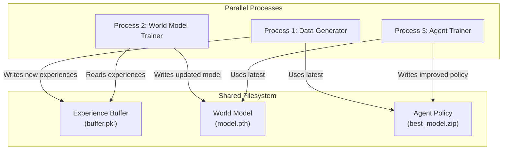

# Neuromorphic Model-Based Reinforcement Learning (NMBRL)

This repository implements a model-based reinforcement learning (MBRL) framework designed for rapid, online learning. The system continuously collects data, refines a world model, and trains an agent in a tight loop, allowing the agent to learn a task like CartPole from scratch efficiently.

## 1. System Architecture

The core of this project is a dynamic, multi-process architecture where three key components operate in parallel, communicating through a shared data folder. This design allows the agent to learn from an ever-improving world model while that model simultaneously learns from new data collected by the agent.



### System Components

1.  **Data Generator (`dynamic_data_generator.py`):**
    - Interacts with the real (simulated) environment.
    - Uses the most recent version of the trained agent policy to take actions.
    - Collects experience tuples `(s, a, s', r, done)` and writes them to a shared `Experience Buffer`.

2.  **World Model Trainer (`dynamic_train_world_model.py`):**
    - Continuously monitors the `Experience Buffer` for new data.
    - When sufficient new data is available, it trains (or fine-tunes) a neural network to predict the environment's dynamics: `(s', r) = f(s, a)`.
    - Saves the updated `World Model` to the shared folder.

3.  **Agent Trainer (`dynamic_train_agent.py`):**
    - Trains a Stable-Baselines3 agent (e.g., SAC or PPO).
    - Instead of using the real environment, it trains inside an "imagined" environment wrapper that uses the latest `World Model` to simulate outcomes.
    - As the agent improves, it saves the new `Agent Policy` to the shared folder, which is then picked up by the `Data Generator`.

This cyclical process creates a feedback loop where better policies lead to better data, which leads to better world models, which in turn leads to better policies.

## 2. Project Structure

The repository is organized around the core learning components and their dependencies.

```
Neuromorphic_MBRL/
├── agents/
│   └── actor_wrapper.py        # Wrapper for SB3 agents for dynamic loading
├── configs/
│   └── full_system_config.yaml # Central configuration for the entire system
├── learning/
│   ├── dynamic_data_generator.py   # Process 1: Collects data
│   ├── dynamic_train_world_model.py # Process 2: Trains world model
│   └── dynamic_train_agent.py      # Process 3: Trains agent in imagination
├── networks/
│   └── world_model_v1.py       # The PyTorch world model network
├── world_models/
│   ├── dmc_cartpole_wrapper.py       # Wrapper for the "real" dm_control environment
│   └── dynamic_world_model_wrapper.py # "Imagined" environment for agent training
├── utils/
│   ├── tools.py
│   └── visualize_sb3_agent.py  # Script for evaluating a trained agent
├── README.md
├── requirements.txt
└── run_full_system.py          # Main script to launch all processes
```

## 3. Installation

1.  **Clone the repository:**
    ```bash
    git clone https://github.com/your-username/Neuromorphic_MBRL.git
    cd Neuromorphic_MBRL
    ```

2.  **Create and activate a Conda environment:**
    ```bash
    conda create -n NMBRL python=3.11 -y
    conda activate NMBRL
    ```

3.  **Install system-level dependencies for dm_control:**
    The DeepMind Control Suite may require system packages for rendering.
    ```bash
    # On Debian/Ubuntu
    sudo apt-get update && sudo apt-get install -y libgl1-mesa-glx libosmesa6-dev libglew-dev patchelf
    ```

4.  **Install the required Python packages:**
    ```bash
    pip install -r requirements.txt
    ```

## 4. Usage

### Running the Full System

The entire learning system is launched with a single script. It will start the data generator, world model trainer, and agent trainer in parallel.

```bash
python run_full_system.py
```

-   All output will be managed by the script, either in separate console windows (on Windows) or piped to the main console.
-   A unique run folder (e.g., `runs/20240101_120000/`) will be created to store all artifacts: the data buffer, world model, agent models, and logs.
-   To stop the system, press `Ctrl+C` in the main console or close the agent's simulation window.

### Configuration

All parameters for the run are controlled by `configs/full_system_config.yaml`. This file allows you to configure:
-   Agent type (SAC, PPO)
-   World model architecture and training parameters
-   Total training timesteps
-   ...and other hyperparameters.

### Monitoring and Evaluation

#### TensorBoard Logs

The agent's training progress (e.g., rewards, loss) is logged by Stable-Baselines3 and can be viewed with TensorBoard.

1.  **Find your run folder:** e.g., `runs/20240101_120000/`
2.  **Launch TensorBoard:**
    ```bash
    tensorboard --logdir runs/
    ```
    This will allow you to select and view the logs for any run.
